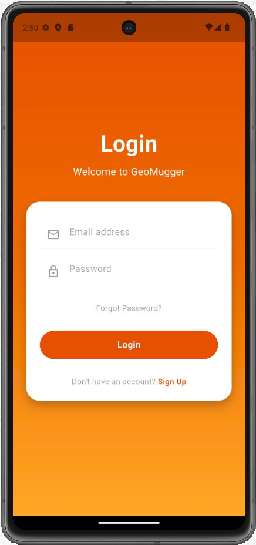
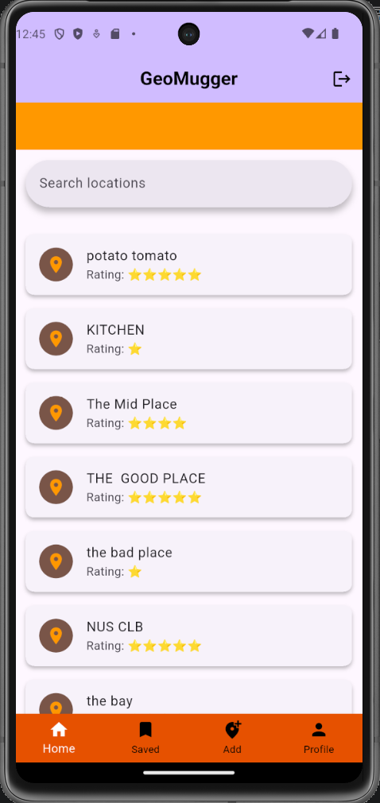
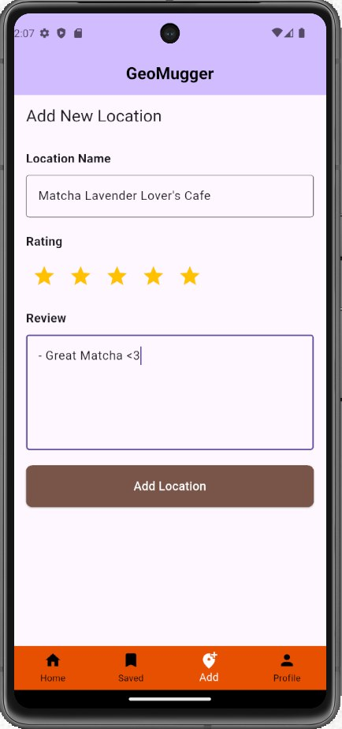
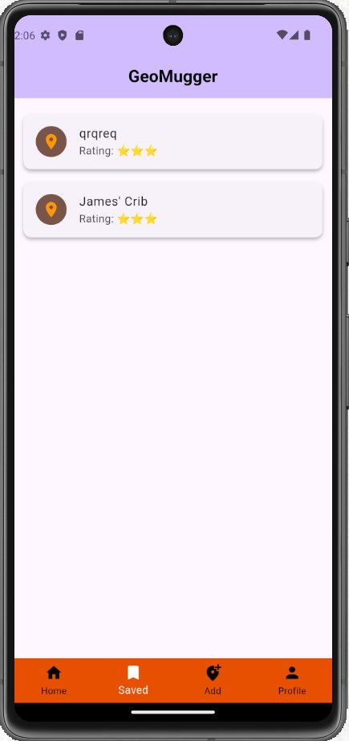
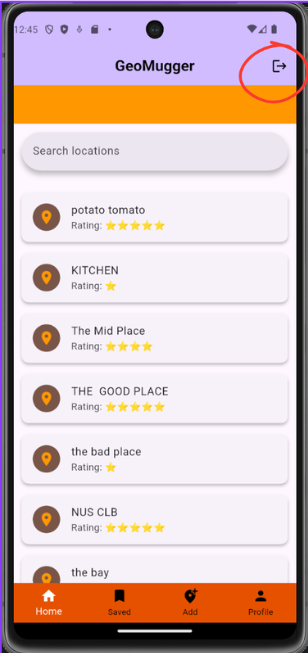

# NUS Orbital 2026 - GeoMugger
Orbitals 2026 project
by Lawrence and Hui Zhong

## Test

<!-- PROJECT SHIELDS -->
<!--
*** I'm using markdown "reference style" links for readability.
*** Reference links are enclosed in brackets [ ] instead of parentheses ( ).
*** See the bottom of this document for the declaration of the reference variables
*** for contributors-url, forks-url, etc. This is an optional, concise syntax you may use.
*** https://www.markdownguide.org/basic-syntax/#reference-style-links
-->
[![Contributors][contributors-shield]][contributors-url]
[![Forks][forks-shield]][forks-url]
[![Stargazers][stars-shield]][stars-url]

 

  <a href="https://github.com/therz1/Orbital-GeoMugger">
    <!-- // TO BE INSERTED LATER ON -->
  </a>

<!-- TABLE OF CONTENTS -->

  
Table of Contents

  <ol>
    <li>
      <a href="#about-the-project">About The Project</a>
      <ul>
        <li><a href="#motivation">Motivation</a></li>
      </ul>
      <ul>
        <li><a href="#aim">Aim</a></li>
      </ul>
      <ul>
        <li><a href="#user-stories">User Stories</a></li>
      </ul>
    </li>
    <li><a href="#scope">Project Scope</a></li>
      <ul>
        <li><a href="#features-implemented-thus-far">User Stories</a></li>
      </ul>
      <ul>
        <li><a href="#built-with">Tech Stack</a></li>
      </ul>
    <li><a href="#guide">Guide to Use</a></li>
    <li><a href="#roadmap">Roadmap</a></li>
    <li><a href="#contributing">Contributing</a></li>
  </ol>

<!-- ABOUT THE PROJECT -->
## About The Project
Ever find your study spots lackluster? Perhaps it's time to spice things up! Geo Mugger provides information about your current study spots as well as personalized recommendations for new study areas tailored just for you! Explore nearby cafes, quiet gardens around your study area during your breaks. Discover new study spots that meet YOUR requirement with Geo Mugger. 

GeoMugger allows students to search and find/ get recommended study areas. In addition, the app should also provide the user with more information about the study spot (e.g. crowd level & amenities provided) so they can pick the optimal study spot. Lastly, users can post and review study spots they discover for other users to see.

(<a href="#readme-top">back to top</a>)

### Motivation
During one of my study sessions at com 1 basement, I decided to take a stroll around the school compound during my study breaks. While strolling, I discovered many new facilities close by that I wasn't aware of previously.

A lot of times I also feel mentally exhausted when I keep revisiting the same study spots because I am unsure if other study spots provide amenities like air-conditioning or power plugs that suit my study needs.

Wouldn't it be nice if there is a platform dedicated to reviewing and recommending study spots for students?

(<a href="#readme-top">back to top</a>)

### Aim
Enable students to discover more locations to study or find out more about their current study spots through the use of reviews and recommendation systems.

(<a href="#readme-top">back to top</a>)

### User Stories
- As a student who focuses better with white noise, I want the app to recommend "vibrant" cafes instead of silent libraries, so that I don't feel awkward if I need to discuss a project with a friend.
- As a student whose laptop battery is at 10%, I want to filter for spots specifically labeled with "high charging port availability," so that I don't waste time walking to a place where I can't plug in.
- As a student that likes nature and green scenery, I would like study spots located near these environments so I can visit them during my study breaks.

(<a href="#readme-top">back to top</a>)

## Scope
The Android app is a platform dedicated for students to post reviews about study spots.

**How are we different from similar platforms?**
- **Google Maps / Yelp:** Too many locations present, the app is not designed specifically for study spots.
- **Muggerino :** The app provides information about the study spots but it does not have a recommendation system to suggest new study spots to users.

### Features implemented thus far:
**Features implemented by Milestone 1:**

- Login/Register
- Home Page
- Adding Locations
- Saving and viewing your saved locations

### Built With

* [![Flutter][Flutter]][Flutter-url]
* [![Firebase][Firebase Studio]][Firebase-url]

(<a href="#readme-top">back to top</a>)

<!-- USAGE EXAMPLES -->
## Usage
Follow these steps to explore, add, and manage locations within GeoMugger.

  

### 1. Authentication (Login & Sign Up)
* **Create an Account:** If you are a new user, enter a valid email address and password, then tap the "sign up" action button.
* **Sign In:** Existing users can log in securely using their registered email and password. 
For debugging and testcases, use these values(temporarily):
  * Email: testuser@geomugger.com
  * Password: password123

  

### 2. Exploring Spots & Reviews
* **The Master Feed:** Once logged in, you will land directly on the **Home View** dashboard showing a clean list of all logged locations uploaded by users.
* **View Details:** Tap on any location card widget to seamlessly transition into its dedicated **Location Detail Page**. Here you can read full comprehensive user reviews and see their respective star rating distributions.

  

### 3. Adding a New Spot
* **Navigate to Form:** Tap the **Add Location** tab option from the persistent bottom navigation bar.
* **Input Information:** 
  1. Type in the unique **Location Name** (e.g., *Banzai Pipeline*).
  2. Select a star rating value ranging from 1 to 5 stars by tapping the interactive star array indicators.
  3. Provide an honest, detailed write-up in the multi-line **Review** text block field.
* **Save to Cloud:** Tap the **Add Location** button. A loading indicator will activate as the payload establishes asynchronous network handshakes with Firestore.
* **Success Feedback:** Upon successful server synchronization, a green notification SnackBar will slide up confirming the write action, and the inputs will auto-reset so you can easily register another location.

  

### 4. Secure Sign Out
* **Checking your saved Locations:** Click the **Saved** tab to check your saved locations as well as the review.

  

### 5. Secure Sign Out
* **Ending Your Session:** Click the **Log Out** button on the top-right of the page to securely disconnect your local session state configuration. This clears your device credentials and safely replaces your active route bounds back to the secure Login Screen layout framework.

(<a href="#readme-top">back to top</a>)

<!-- ROADMAP -->
## Roadmap

### Phase 1: (due June 1 2026):
- Login/Register
- Home Page
- Adding Locations
- Saving and viewing your saved locations

### Phase 2: (mid June)
- **Improved Review system**

Allow users to assign tags to a place like 'air-con' when reviewing the study spots. Allow multiple users to review the same study spots.

- **Search and Filter System**

Allow users to search location from the existing study spots added. Users can filter based on the tags assigned in the review.

- **Database**

Allow users to add pictures of the locations.Insert existing and common study spots like various nlb.

### Phase 3: (end June)
- **UI/UX refinement**
- **Recommendation System**
- **Profile Page**

Apps recommend study spots based on user's past reviews or saved study spots. Done by utilising machine learning techniques like collaborative filtering or association rule.

### Phase 4: (July and Beyond)
- **Location**

Allow users to navigate to nearby study spots using Google Maps API

(<a href="#readme-top">back to top</a>)

<!-- CONTRIBUTORS -->
### Contributors:

<!-- MARKDOWN LINKS & IMAGES -->
<!-- https://www.markdownguide.org/basic-syntax/#reference-style-links -->
[contributors-shield]: https://img.shields.io/github/contributors/therz1/Orbital-GeoMugger.svg?style=for-the-badge
[contributors-url]: https://github.com/therz1/Orbital-GeoMugger/graphs/contributors
[forks-shield]: https://img.shields.io/github/forks/therz1/Orbital-GeoMugger.svg?style=for-the-badge
[forks-url]: https://github.com/therz1/Orbital-GeoMugger/network/members
[stars-shield]: https://img.shields.io/github/stars/therz1/Orbital-GeoMugger.svg?style=for-the-badge
[stars-url]: https://github.com/therz1/Orbital-GeoMugger/stargazers

<!-- Shields.io badges. You can a comprehensive list with many more badges at: https://github.com/inttter/md-badges -->
[Flutter]: https://img.shields.io/badge/Flutter-02569B?logo=flutter&logoColor=fff
[Flutter-url]: https://flutter.dev/
[Firebase Studio]: https://custom-icon-badges.demolab.com/badge/Firebase%20Studio-F66C21?logo=firebase-studio&logoColor=fff
[Firebase-url]: https://firebase.google.com
